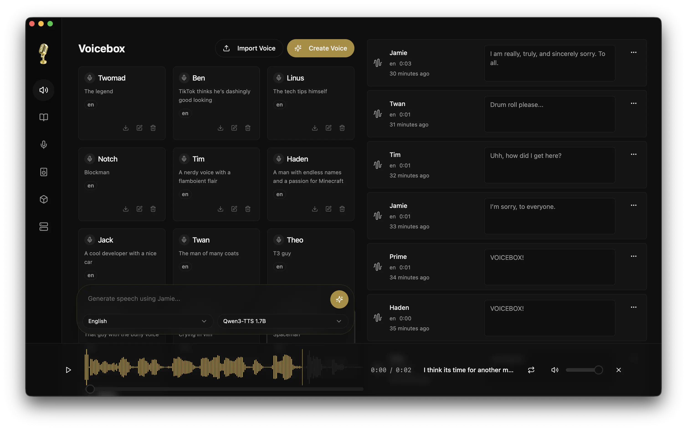
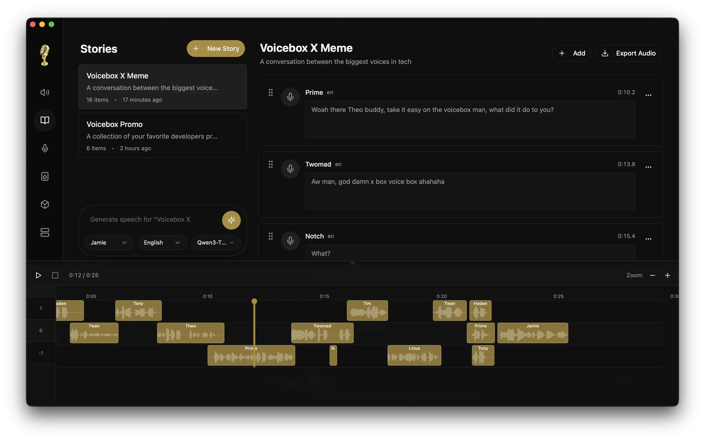
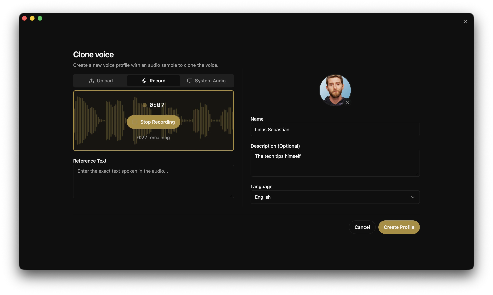

<p align="center">
  
</p>

<h1 align="center">Voicebox</h1>

<p align="center">
  <strong>El estudio de voz con IA de código abierto.</strong><br/>
  Clona cualquier voz. Genera voz. Dicta en cualquier app. Habla con agentes en voces que son tuyas.<br/>
  Toda la pila de E/S de voz, ejecutándose localmente en tu equipo.
</p>

<p align="center">
  <a href="README.md">English</a> · <strong>Español</strong>
</p>

<p align="center">
  <a href="https://github.com/jamiepine/voicebox/releases">
    
  </a>
  <a href="https://github.com/jamiepine/voicebox/releases/latest">
    
  </a>
  <a href="https://github.com/jamiepine/voicebox/stargazers">
    
  </a>
  <a href="https://github.com/jamiepine/voicebox/blob/main/LICENSE">
    
  </a>
  <a href="https://deepwiki.com/jamiepine/voicebox">
    
  </a>
</p>

<p align="center">
    <a href="https://trendshift.io/repositories/21213" target="_blank"></a>
</p>

<p align="center">
  <a href="https://voicebox.sh">voicebox.sh</a> •
  <a href="https://docs.voicebox.sh">Documentación</a> •
  <a href="#descargar">Descargar</a> •
  <a href="#funciones">Funciones</a> •
  <a href="#api">API</a> •
  <a href="docs/content/docs/overview/troubleshooting.mdx">Solución de problemas</a>
</p>

<br/>

<p align="center">
  <a href="https://voicebox.sh">
    
  </a>
</p>

<p align="center">
  <em>Haz clic en la imagen de arriba para ver el vídeo de demostración en <a href="https://voicebox.sh">voicebox.sh</a></em>
</p>

<br/>

<p align="center">
  
</p>

<p align="center">
  
</p>

<br/>

## ¿Qué es Voicebox?

Voicebox es un **estudio de voz con IA local-first**: una alternativa gratuita y de código abierto a **ElevenLabs** y **WisprFlow** en una sola app. Clona voces a partir de unos segundos de audio, genera voz en 23 idiomas con 7 motores TTS, dicta en cualquier campo de texto con un atajo global y dale a cualquier agente de IA compatible con MCP una voz de tu elección.

Los dos referentes en la nube ocupan mitades opuestas del bucle de E/S de voz: ElevenLabs en la salida, WisprFlow en la entrada. Voicebox hace ambas, las conecta con un LLM local incluido para el refinamiento y las personalidades por perfil, y ejecuta todo en tu equipo.

- **Privacidad total** — los modelos, los datos de voz y las capturas nunca salen de tu equipo
- **7 motores TTS** — Qwen3-TTS, Qwen CustomVoice, LuxTTS, Chatterbox Multilingual, Chatterbox Turbo, HumeAI TADA y Kokoro
- **Clonación de voz y voces predefinidas** — clonación zero-shot a partir de una muestra de referencia, o más de 50 voces predefinidas y curadas vía Kokoro y Qwen CustomVoice
- **23 idiomas** — del inglés al árabe, japonés, hindi, suajili y más
- **Efectos de posprocesado** — cambio de tono, reverberación, retardo, coro, compresión y filtros
- **Voz expresiva** — etiquetas paralingüísticas como `[laugh]`, `[sigh]`, `[gasp]` vía Chatterbox Turbo; control de la interpretación en lenguaje natural vía Qwen CustomVoice
- **Longitud ilimitada** — fragmentación automática con fundido cruzado para guiones, artículos y capítulos
- **Editor de historias** — línea de tiempo multipista para conversaciones, pódcasts y narraciones
- **Entrada de voz** — atajo global de dictado con modos pulsar para hablar y alternancia, pegado automático verificado por Accesibilidad en macOS, micrófono in-app en cada campo de texto, STT basado en Whisper
- **Salida de voz para agentes** — una sola llamada de herramienta (`voicebox.speak`) y cualquier agente compatible con MCP (Claude Code, Cursor, Cline) te habla en una voz que has clonado
- **Personalidades de voz** — asigna una personalidad libre a cualquier perfil de voz y luego usa Redactar, Reescribir o Responder mediante un LLM local incluido; los agentes pueden invocar los mismos modos por MCP
- **API-first** — API REST más un servidor MCP integrado para incorporar E/S de voz a tus propias apps y agentes
- **Rendimiento nativo** — construido con Tauri (Rust), no Electron
- **Funciona en todas partes** — macOS (MLX/Metal), Windows (CUDA), Linux, AMD ROCm, Intel Arc, Docker

---

## Descargar

| Plataforma            | Descarga                                               |
| --------------------- | ------------------------------------------------------ |
| macOS (Apple Silicon) | [Descargar DMG](https://voicebox.sh/download/mac-arm)   |
| macOS (Intel)         | [Descargar DMG](https://voicebox.sh/download/mac-intel) |
| Windows               | [Descargar MSI](https://voicebox.sh/download/windows)   |
| Docker                | `docker compose up`                                    |

> **[Ver todos los binarios →](https://github.com/jamiepine/voicebox/releases/latest)**

> **Linux** — Aún no hay binarios precompilados. Consulta [voicebox.sh/linux-install](https://voicebox.sh/linux-install) para las instrucciones de compilación desde el código fuente.

> **¿Problemas?** Consulta la [guía de solución de problemas](docs/content/docs/overview/troubleshooting.mdx) para incidencias comunes de instalación, generación, descarga de modelos y GPU.

---

## Funciones

### Clonación de voz multimotor

Siete motores TTS con puntos fuertes distintos, intercambiables en cada generación:

| Motor                       | Idiomas   | Puntos fuertes                                                                                                                           |
| --------------------------- | --------- | ---------------------------------------------------------------------------------------------------------------------------------------- |
| **Qwen3-TTS** (0.6B / 1.7B) | 10        | Clonación multilingüe de alta calidad, instrucciones de interpretación ("habla despacio", "susurra")                                     |
| **Qwen CustomVoice**        | 10        | 9 voces predefinidas curadas con control de interpretación en lenguaje natural — sin audio de referencia                                 |
| **LuxTTS**                  | Inglés    | Ligero (~1 GB de VRAM), salida a 48 kHz, 150x tiempo real en CPU                                                                          |
| **Chatterbox Multilingual** | 23        | La cobertura de idiomas más amplia — árabe, danés, finés, griego, hebreo, hindi, malayo, noruego, polaco, suajili, sueco, turco y más    |
| **Chatterbox Turbo**        | Inglés    | Modelo rápido de 350M con etiquetas paralingüísticas de emoción/sonido                                                                    |
| **TADA** (1B / 3B)          | 10        | Modelo de lenguaje-habla de HumeAI — audio coherente de más de 700 s, alineación dual texto-acústica                                      |
| **Kokoro**                  | 8         | 50 voces predefinidas curadas, modelo diminuto de 82M, inferencia rápida en CPU                                                          |

### Emociones y etiquetas paralingüísticas

Solo **Chatterbox Turbo** interpreta etiquetas paralingüísticas como `[laugh]` y
`[sigh]`. Qwen3-TTS, LuxTTS, Chatterbox Multilingual y HumeAI TADA las leen
literalmente como texto.

Con **Chatterbox Turbo** seleccionado, escribe `/` en el campo de texto para abrir el
insertador de etiquetas y añadir etiquetas expresivas en línea con el habla:

`[laugh]` `[chuckle]` `[gasp]` `[cough]` `[sigh]` `[groan]` `[sniff]` `[shush]` `[clear throat]`

### Efectos de posprocesado

8 efectos de audio con la biblioteca `pedalboard` de Spotify. Se aplican tras la generación, con vista previa en tiempo real y preajustes reutilizables.

| Efecto            | Descripción                                       |
| ----------------- | ------------------------------------------------- |
| Cambio de tono    | Hacia arriba o abajo hasta 12 semitonos           |
| Reverberación     | Tamaño de sala, amortiguación y mezcla húmedo/seco configurables |
| Retardo           | Eco con tiempo, realimentación y mezcla ajustables |
| Coro / Flanger    | Retardo modulado para texturas metálicas o densas |
| Compresor         | Compresión de rango dinámico                      |
| Ganancia          | Ajuste de volumen (−40 a +40 dB)                  |
| Filtro paso alto  | Elimina las frecuencias bajas                     |
| Filtro paso bajo  | Elimina las frecuencias altas                     |

Incluye 4 preajustes integrados (Robótica, Radio, Cámara de eco, Voz grave) y admite preajustes personalizados. Los efectos pueden asignarse por perfil como predeterminados.

### Longitud de generación ilimitada

El texto se divide automáticamente en los límites de las frases y cada fragmento se genera por separado, para luego unirse con fundido cruzado. Funciona con todos los motores.

- Límite de fragmentación automática configurable (100–5000 caracteres)
- Control deslizante de fundido cruzado (0–200 ms) para transiciones suaves
- Longitud máxima de texto: 50 000 caracteres
- La división inteligente respeta abreviaturas, puntuación CJK y `[etiquetas]`

### Versiones de generación

Cada generación admite varias versiones con seguimiento de procedencia:

- **Original** — salida TTS limpia, siempre conservada
- **Versiones con efectos** — aplica distintas cadenas de efectos desde cualquier versión de origen
- **Tomas** — regenera con una nueva semilla para variar
- **Seguimiento de origen** — cada versión registra su linaje
- **Favoritos** — marca generaciones con estrella para acceso rápido

### Cola de generación asíncrona

La generación no bloquea. Envía y empieza a escribir la siguiente de inmediato.

- La cola de ejecución en serie evita la contención de la GPU
- Streaming de estado en tiempo real vía SSE
- Las generaciones fallidas se pueden reintentar
- Las generaciones obsoletas por cierres inesperados se recuperan solas al arrancar

### Gestión de perfiles de voz

- Crea perfiles a partir de archivos de audio o grábalos directamente en la app
- Importa/exporta perfiles para compartirlos o respaldarlos
- Compatible con varias muestras para una clonación de mayor calidad
- Cadenas de efectos predeterminadas por perfil
- Organiza con descripciones y etiquetas de idioma

### Editor de historias

Editor de línea de tiempo multivoz para conversaciones, pódcasts y narraciones.

- Composición multipista con arrastrar y soltar
- Recorte y división de audio en línea
- Reproducción automática con cabezal sincronizado
- Fijación de versión por clip de pista

### Dictado global y entrada de voz

La otra mitad del bucle de E/S de voz. Mantén pulsado un atajo en cualquier parte de tu sistema, habla, suelta — en macOS la transcripción se pega directamente en el campo de texto activo. O pulsa el micrófono en cualquier campo de texto de Voicebox y dicta directamente en la app.

- **Combinaciones de teclas configurables** — combinaciones de mantener-para-hablar y pulsar-para-alternar, cada una reasignable en el selector de combinaciones in-app. Manteniendo pulsar para hablar y tocando `Espacio` a mitad de pulsación se asciende a una sesión de alternancia sin cortes en el audio
- **Pegado consciente del destino (macOS)** — inyección verificada por Accesibilidad en el campo de texto activo, con guardado/restauración atómica del portapapeles para que no se sobrescriba
- **UX de permisos en el primer uso** — las puertas in-app te guían por la concesión de Accesibilidad y Monitorización de entrada de macOS con enlaces directos a Ajustes del Sistema
- **Botón de micrófono in-app** en cada campo de texto de Voicebox — formulario de generación, descripciones de perfil, títulos de historia, donde sea que escribas
- **Refinamiento por LLM** — limpieza opcional de muletillas, tartamudeos y falsos comienzos antes de pegar
- **Píldora en pantalla** — superposición flotante que muestra los estados `grabando`, `transcribiendo`, `refinando` y `hablando`. La misma píldora que usan los agentes cuando te hablan, así hay un único modelo mental para ambas direcciones del bucle

### Voz a texto

Voicebox ejecuta OpenAI Whisper para la transcripción — el mismo modelo que sustenta el dictado, la pestaña Capturas y la API `/transcribe`. Se ejecuta en MLX (Apple Silicon) o PyTorch (CUDA / ROCm / DirectML / CPU) según tu plataforma.

| Tamaño                        | Notas                                              |
| ----------------------------- | -------------------------------------------------- |
| Base / Small / Medium / Large | Escalera de calidad estándar de Whisper            |
| Turbo                         | ~8x más rápido que Whisper Large, con pérdida mínima de calidad |

Se planean más motores (Parakeet v3, Qwen3-ASR) — consulta la [hoja de ruta](#hoja-de-ruta).

### Capturas

Cada dictado, grabación in-app y archivo de audio subido aparece en la pestaña Capturas — audio original emparejado con su transcripción, siempre conservado.

- **Reproduce, vuelve a transcribir, refina** — reejecuta STT con cualquier tamaño de Whisper, o reprocesa la transcripción en bruto con el LLM local con distintos ajustes (limpieza de muletillas, eliminación de autocorrecciones, conservación de términos técnicos)
- **Edita en línea** — ajusta la transcripción y se guarda al perder el foco
- **Reproducir como perfil de voz** — convierte cualquier captura en voz con una voz clonada, en un clic
- **Promover a muestra de voz** — usa el audio + transcripción de una captura como muestra de referencia en cualquier perfil de voz
- **Almacenamiento local de capturas** — el audio original y la transcripción se quedan en tu directorio de datos de Voicebox, con un acceso directo a la carpeta en Ajustes

### Salida de voz para agentes

Cada agente tiene voz. Una sola llamada de herramienta y cualquier agente compatible con MCP puede hablarte en una voz que has clonado — finalizaciones de tareas, preguntas, notificaciones. La misma píldora que aparece durante el dictado aparece durante el habla del agente, así siempre ves lo que sale de tu equipo.

```ts
// En cualquier agente compatible con MCP:
await voicebox.speak({
  text: "Despliegue completado.",
  profile: "Morgan",
});
```

También expuesto como `POST /speak` para todo lo que no hable MCP — ACP, A2A, scripts de shell, arneses personalizados.

- **Píldora bidireccional** — `grabando`, `transcribiendo`, `refinando` y `hablando` son estados de la misma superposición a nivel de SO, así que el dictado y el habla del agente comparten una sola superficie
- **Vinculación de voz por agente** — en **Ajustes → MCP**, asigna Claude Code a Morgan y Cursor a Scarlett para saber qué agente habla sin mirar. La marca de tiempo `last_seen_at` de cada cliente confirma que la instalación funcionó
- **Siempre visible** — sin TTS silencioso en segundo plano; cada habla iniciada por un agente muestra la píldora con el nombre del perfil de voz durante toda su duración
- **Transportes HTTP + stdio** — instálalo como URL en el MCP de Claude Code / Cursor / Windsurf / VS Code, o apunta los clientes solo-stdio al binario `voicebox-mcp` incluido

### Personalidades de voz

Asigna una personalidad libre a cualquier perfil de voz — quién es esta voz, cómo habla, qué le importa. Aparecen dos acciones en el cuadro de generación cuando hay una personalidad definida, impulsadas por un LLM Qwen3 incluido que se ejecuta enteramente en local.

- **Redactar** — un botón de barajar que deja una frase fresca en personaje en el área de texto; edita y habla, o haz clic de nuevo para otra versión
- **Hablar en personaje** — un interruptor que pasa tu texto de entrada por el LLM de personalidad para reescribirlo en su voz antes del TTS

Los agentes pueden acceder a la misma ruta de reescritura por MCP pasando `personality: true` a `voicebox.speak`, convirtiendo la herramienta en una tubería texto-de-entrada → LLM-de-personalidad → TTS. El mismo LLM sustenta el paso de refinamiento del dictado — un LLM en la app, una caché de modelo, una huella de memoria de GPU.

**Opciones de LLM local:** Qwen3 0.6B / 1.7B / 4B, compartiendo el runtime de TTS (MLX en Apple Silicon, PyTorch en el resto).

Casos de uso: bucles de desarrollo con agentes (dicta una pregunta, escucha la respuesta en una voz clonada), personajes interactivos para juegos y herramientas narrativas, asistencia del habla para personas que no pueden hablar con su voz original.

### Gestión de modelos

- Liberación por modelo para liberar memoria de GPU sin borrar las descargas
- Directorio de modelos personalizado vía `VOICEBOX_MODELS_DIR`
- Migración de la carpeta de modelos con seguimiento del progreso
- Interfaz para cancelar/limpiar descargas

### Compatibilidad con GPU

| Plataforma               | Backend        | Notas                                          |
| ------------------------ | -------------- | ---------------------------------------------- |
| macOS (Apple Silicon)    | MLX (Metal)    | 4-5x más rápido vía Neural Engine              |
| Windows / Linux (NVIDIA) | PyTorch (CUDA) | Descarga el binario CUDA automáticamente desde la app |
| Linux (AMD)              | PyTorch (ROCm) | Configura HSA_OVERRIDE_GFX_VERSION automáticamente |
| Windows (cualquier GPU)  | DirectML       | Compatibilidad universal con GPU en Windows    |
| Intel Arc                | IPEX/XPU       | Aceleración con GPU discreta de Intel          |
| Cualquiera               | CPU            | Funciona en todas partes, solo que más lento   |

---

## API

Voicebox expone una API REST para integrar E/S de voz en tus propias apps y agentes.

```bash
# Generar voz
curl -X POST http://127.0.0.1:17493/generate \
  -H "Content-Type: application/json" \
  -d '{"text": "Hello world", "profile_id": "abc123", "language": "en"}'

# Salida de voz para agentes — cualquier app o script puede hablar en una voz clonada
curl -X POST http://127.0.0.1:17493/speak \
  -H "Content-Type: application/json" \
  -H "X-Voicebox-Client-Id: my-script" \
  -d '{"text": "Deploy complete.", "profile": "Morgan"}'

# Transcribir un archivo de audio
curl -X POST http://127.0.0.1:17493/transcribe \
  -F "audio=@recording.wav" \
  -F "model=whisper-turbo"

# Listar perfiles de voz
curl http://127.0.0.1:17493/profiles
```

`POST /speak` acepta `profile` como nombre (sin distinguir mayúsculas) o id, y lo resuelve con la misma precedencia que la herramienta MCP: argumento explícito → vinculación por cliente → `capture_settings.default_playback_voice_id`.

### Servidor MCP

Voicebox incluye un servidor **Model Context Protocol** integrado para que cualquier agente compatible con MCP (Claude Code, Cursor, Windsurf, Cline, extensiones MCP de VS Code) pueda hablar, transcribir y explorar capturas y perfiles.

**Comando de una línea para Claude Code:**

```
claude mcp add voicebox \
  --transport http \
  --url http://127.0.0.1:17493/mcp \
  --header "X-Voicebox-Client-Id: claude-code"
```

**Cualquier cliente MCP por HTTP** (Cursor, Windsurf, VS Code, etc.):

```json
{
  "mcpServers": {
    "voicebox": {
      "url": "http://127.0.0.1:17493/mcp",
      "headers": { "X-Voicebox-Client-Id": "cursor" }
    }
  }
}
```

**Alternativa por stdio** para clientes que no hablan MCP por HTTP — apunta al binario `voicebox-mcp` incluido dentro de la app:

```json
{
  "mcpServers": {
    "voicebox": {
      "command": "/Applications/Voicebox.app/Contents/MacOS/voicebox-mcp",
      "env": { "VOICEBOX_CLIENT_ID": "claude-desktop" }
    }
  }
}
```

Se incluyen cuatro herramientas: `voicebox.speak`, `voicebox.transcribe`, `voicebox.list_captures`, `voicebox.list_profiles`. Las vinculaciones de voz por cliente se gestionan en **Voicebox → Ajustes → MCP**. Consulta la [guía completa de MCP](docs/content/docs/overview/mcp-server.mdx) para las firmas de las herramientas, la precedencia de resolución, el contrato de la píldora de habla y las notas de seguridad.

```ts
// En cualquier agente compatible con MCP:
await voicebox.speak({
  text: "Tests passing. Ready to merge.",
  profile: "Morgan",      // opcional — recurre a la vinculación por cliente
  personality: true,      // opcional — reescribe el texto con el LLM de personalidad del perfil primero
});
```

**Casos de uso:** bucles de desarrollo con agentes (voz de entrada, voz de salida), diálogos de videojuegos, producción de pódcasts, herramientas de accesibilidad, asistentes de voz, automatización de contenido.

Documentación completa de la API disponible en `http://127.0.0.1:17493/docs`.

---

## Pila tecnológica

| Capa          | Tecnología                                                                      |
| ------------- | ------------------------------------------------------------------------------- |
| App de escritorio | Tauri (Rust)                                                                |
| Frontend      | React, TypeScript, Tailwind CSS                                                 |
| Estado        | Zustand, React Query                                                            |
| Backend       | FastAPI (Python)                                                                |
| Motores TTS   | Qwen3-TTS, Qwen CustomVoice, LuxTTS, Chatterbox, Chatterbox Turbo, TADA, Kokoro |
| STT           | Whisper / Whisper Turbo (PyTorch o MLX)                                         |
| LLM local     | Qwen3 (0.6B / 1.7B / 4B), runtime compartido con TTS / STT                      |
| Servidor MCP  | FastMCP montado en `/mcp` (HTTP en streaming) + binario adaptador stdio incluido |
| Adaptador nativo | Rust (dentro de Tauri) para el atajo global, la inyección de pegado y la introspección de foco |
| Efectos       | Pedalboard (Spotify)                                                            |
| Inferencia    | MLX (Apple Silicon) / PyTorch (CUDA/ROCm/XPU/CPU)                               |
| Base de datos | SQLite                                                                          |
| Audio         | WaveSurfer.js, librosa                                                          |

---

## Hoja de ruta

| Función                            | Descripción                                                              |
| ---------------------------------- | ------------------------------------------------------------------------ |
| **Pegado automático en Windows / Linux** | Paridad del pegado del dictado — `SendInput` en Windows, `uinput` / AT-SPI en Linux |
| **Ampliación de motores STT**      | Parakeet v3 y Qwen3-ASR sumándose a Whisper — más de 50 idiomas, mejor calidad fuera del inglés |
| **Enrutamiento de tuberías**       | Cadenas configurables origen → transformación → destino con destinos webhook + MCP y un editor de preajustes |
| **Transcripción en streaming**     | `/transcribe/stream` por WebSocket para transcripciones parciales mientras hablas |
| **LLM de habla de extremo a extremo** | Moshi, GLM-4-Voice, Qwen2.5 Omni — voz a voz real, sin texto intermedio |
| **Diseño de voz**                  | Crea voces nuevas a partir de descripciones de texto                     |
| **Captura de formato largo**       | Grabador de doble flujo (micrófono + audio del sistema) con transformación por LLM de resumen |
| **Destinos de plataforma**         | Apple Notes, Obsidian y otras integraciones opcionales                   |
| **Arquitectura de plugins**        | Amplía con modelos, transformaciones y destinos personalizados           |
| **App complementaria para móvil**  | Controla Voicebox desde tu teléfono                                      |

Para el **estado de ingeniería completo, el triaje de issues abiertos y la cola de trabajo priorizada**, consulta [`docs/PROJECT_STATUS.md`](docs/PROJECT_STATUS.md) — un documento vivo que registra lo que se ha publicado, lo que está en curso, los motores TTS candidatos en evaluación y por qué hemos aceptado o aplazado integraciones concretas.

---

## Desarrollo

Consulta [CONTRIBUTING.md](CONTRIBUTING.md) ([versión en español](CONTRIBUTING.es.md)) para la configuración detallada y las pautas de contribución.

### Inicio rápido

```bash
git clone https://github.com/jamiepine/voicebox.git
cd voicebox

just setup   # crea el venv de Python e instala todas las dependencias
just dev     # arranca el backend + la app de escritorio
```

Instala [just](https://github.com/casey/just): `brew install just` o `cargo install just`. Ejecuta `just --list` para ver todos los comandos.

**Requisitos previos:** [Bun](https://bun.sh), [Rust](https://rustup.rs), [Python 3.11+](https://python.org), [requisitos previos de Tauri](https://v2.tauri.app/start/prerequisites/) y [Xcode](https://developer.apple.com/xcode/) en macOS.

El repo incluye un `.mcp.json` preconfigurado en la raíz — ejecutar Claude Code dentro de este checkout recoge las herramientas MCP de Voicebox automáticamente una vez que la app de desarrollo está en marcha.

### Compilar localmente

```bash
just build          # Compila el binario del servidor CPU + la app Tauri
just build-local    # (Windows) Compila los binarios del servidor CPU + CUDA + la app Tauri
```

### Añadir nuevos modelos de voz

La arquitectura multimotor hace que añadir nuevos motores TTS sea sencillo. Una [guía paso a paso](docs/content/docs/developer/tts-engines.mdx) cubre todo el proceso: investigación de dependencias, implementación del protocolo del backend, cableado del frontend y empaquetado con PyInstaller.

La guía está optimizada para agentes de programación con IA. Una [skill de agente](.agents/skills/add-tts-engine/SKILL.md) puede tomar el nombre de un modelo y encargarse de toda la integración de forma autónoma — tú solo pruebas la compilación localmente.

### Estructura del proyecto

```
voicebox/
├── app/              # Frontend React compartido
├── tauri/            # App de escritorio (Tauri + Rust)
├── web/              # Despliegue web
├── backend/          # Servidor Python FastAPI
├── landing/          # Sitio web de marketing
└── scripts/          # Scripts de compilación y release
```

---

## Contribuir

¡Las contribuciones son bienvenidas! Consulta [CONTRIBUTING.md](CONTRIBUTING.md) ([versión en español](CONTRIBUTING.es.md)) para las pautas.

1. Haz un fork del repo
2. Crea una rama de función
3. Haz tus cambios
4. Envía un PR

## Seguridad

¿Has encontrado una vulnerabilidad de seguridad? Repórtala de forma responsable. Consulta [SECURITY.md](SECURITY.md) ([versión en español](SECURITY.es.md)) para más detalles.

---

## Licencia

Licencia MIT — consulta [LICENSE](LICENSE) para más detalles.

---

<p align="center">
  <a href="https://voicebox.sh">voicebox.sh</a>
</p>
