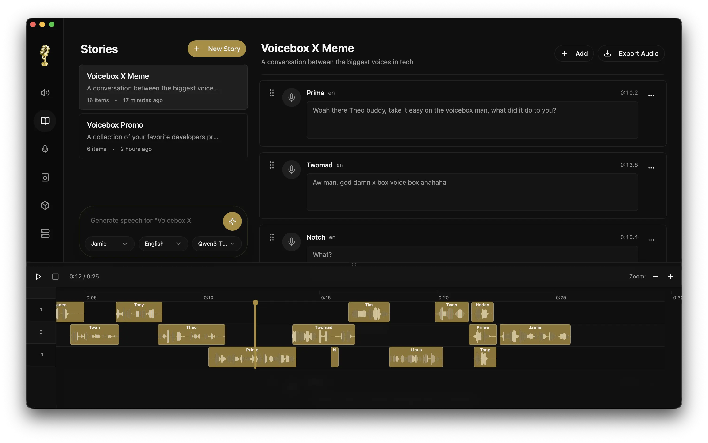
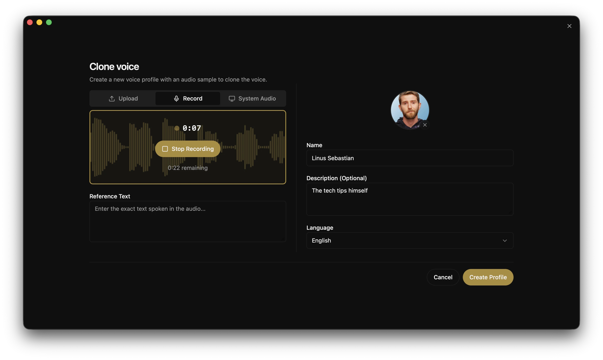

<p align="center">
  
</p>

<h1 align="center">Voicebox</h1>

<p align="center">
  <strong>开源 AI 语音工作室。</strong><br/>
  克隆任意声音。生成语音。听写到任意应用。用你拥有的声音与智能体对话。<br/>
  完整的语音输入/输出技术栈，在你的本地机器上运行。
</p>

<p align="center">
  <a href="https://github.com/jamiepine/voicebox/releases">
    
  </a>
  <a href="https://github.com/jamiepine/voicebox/releases/latest">
    
  </a>
  <a href="https://github.com/jamiepine/voicebox/stargazers">
    
  </a>
  <a href="https://github.com/jamiepine/voicebox/blob/main/LICENSE">
    
  </a>
  <a href="https://deepwiki.com/jamiepine/voicebox">
    
  </a>
</p>

<p align="center">
    <a href="https://trendshift.io/repositories/21213" target="_blank"></a>
</p>

<p align="center">
  <a href="https://voicebox.sh">voicebox.sh</a> •
  <a href="https://docs.voicebox.sh">文档</a> •
  <a href="#download">下载</a> •
  <a href="#features">功能</a> •
  <a href="#api">API</a> •
  <a href="docs/content/docs/overview/troubleshooting.mdx">故障排除</a>
</p>

<br/>

<p align="center">
  <a href="https://voicebox.sh">
    
  </a>
</p>

<p align="center">
  <em>点击上方图片在 <a href="https://voicebox.sh">voicebox.sh</a> 上观看演示视频</em>
</p>

<br/>

<p align="center">
  
</p>

<p align="center">
  
</p>

<br/>

## Voicebox 是什么？

Voicebox 是一个**本地优先的 AI 语音工作室** —— 免费开源的 **ElevenLabs** 和 **WisprFlow** 替代方案，集成于一个应用中。只需几秒音频即可克隆声音，支持 7 个 TTS 引擎、23 种语言的语音生成，通过全局快捷键听写到任意文本框，并为任何支持 MCP 的 AI 智能体赋予你选择的声音。

两大云端巨头分别占据语音输入/输出回路的两端 —— ElevenLabs 负责输出，WisprFlow 负责输入。Voicebox 同时覆盖两端，通过内置的本地 LLM 进行文本优化和分角色人设管理将两端打通，整个流程都在你的机器上本地运行。

- **完全隐私** —— 模型、语音数据和录音永不离开你的机器
- **7 个 TTS 引擎** —— Qwen3-TTS、Qwen CustomVoice、LuxTTS、Chatterbox Multilingual、Chatterbox Turbo、HumeAI TADA 和 Kokoro
- **声音克隆与预设声音** —— 从参考样本零样本克隆，或通过 Kokoro 和 Qwen CustomVoice 使用 50+ 精选预设声音
- **23 种语言** —— 从英语到阿拉伯语、日语、印地语、斯瓦希里语等
- **后处理音效** —— 变调、混响、延迟、合唱、压缩和滤波
- **表现力语音** —— 通过 Chatterbox Turbo 支持副语言标签如 `[laugh]`、`[sigh]`、`[gasp]`；通过 Qwen CustomVoice 支持自然语言演绎控制
- **无限长度** —— 自动分块并交叉淡入淡出，适用于脚本、文章和章节
- **故事编辑器** —— 多轨道时间线，用于对话、播客和叙事
- **语音输入** —— 全局听写快捷键，支持按住说话和切换模式，macOS 上经辅助功能验证的自动粘贴，应用内每个文本框都有麦克风按钮，基于 Whisper 的语音转文字
- **智能体语音输出** —— 一次工具调用（`voicebox.speak`），任何支持 MCP 的智能体（Claude Code、Cursor、Cline）即可用你克隆的声音对你说话
- **声音人格** —— 为任意语音档案附加自由格式的人设，然后通过内置本地 LLM 进行创作、改写或回应 —— 智能体也可通过 MCP 调用相同模式
- **API 优先** —— REST API 加内置 MCP 服务器，将语音输入/输出集成到你自己的应用和智能体中
- **原生性能** —— 基于 Tauri (Rust) 构建，而非 Electron
- **全平台运行** —— macOS (MLX/Metal)、Windows (CUDA)、Linux、AMD ROCm、Intel Arc、Docker

---

## 下载

| 平台                  | 下载链接                                               |
| --------------------- | ------------------------------------------------------ |
| macOS (Apple Silicon) | [下载 DMG](https://voicebox.sh/download/mac-arm)       |
| macOS (Intel)         | [下载 DMG](https://voicebox.sh/download/mac-intel)     |
| Windows               | [下载 MSI](https://voicebox.sh/download/windows)       |
| Docker                | `docker compose up`                                    |

> **[查看全部二进制文件 →](https://github.com/jamiepine/voicebox/releases/latest)**

> **Linux** —— 尚未提供预编译二进制文件。请参阅 [voicebox.sh/linux-install](https://voicebox.sh/linux-install) 获取从源码构建的说明。

> **遇到问题？** 请参阅[故障排除指南](docs/content/docs/overview/troubleshooting.mdx)，涵盖常见的安装、生成、模型下载和 GPU 问题。

---

## 功能

### 多引擎声音克隆

七种 TTS 引擎，各有所长，可按次生成切换：

| 引擎                        | 语言     | 优势                                                                                                                                     |
| --------------------------- | -------- | ---------------------------------------------------------------------------------------------------------------------------------------- |
| **Qwen3-TTS** (0.6B / 1.7B) | 10       | 高质量多语言克隆，演绎指令（"慢慢说"、"耳语"）                                                                                            |
| **Qwen CustomVoice**        | 10       | 9 个精选预设声音，自然语言演绎控制 —— 无需参考音频                                                                                         |
| **LuxTTS**                  | 英语     | 轻量级（~1GB 显存），48kHz 输出，CPU 上 150 倍实时速度                                                                                     |
| **Chatterbox Multilingual** | 23       | 最广泛的语言覆盖 —— 阿拉伯语、丹麦语、芬兰语、希腊语、希伯来语、印地语、马来语、挪威语、波兰语、斯瓦希里语、瑞典语、土耳其语等               |
| **Chatterbox Turbo**        | 英语     | 快速 350M 模型，支持副语言情感/声音标签                                                                                                    |
| **TADA** (1B / 3B)          | 10       | HumeAI 语音语言模型 —— 700 秒+连贯音频，文本-声学双重对齐                                                                                  |
| **Kokoro**                  | 8        | 50 个精选预设声音，仅 82M 小模型，快速 CPU 推理                                                                                            |

### 情感与副语言标签

仅 **Chatterbox Turbo** 能解析副语言标签如 `[laugh]` 和
`[sigh]`。Qwen3-TTS、LuxTTS、Chatterbox Multilingual 和 HumeAI TADA 会将它们
作为普通文本逐字朗读。

选择 **Chatterbox Turbo** 后，在文本输入框中输入 `/` 可打开标签
插入器，在语音中内联添加表现力标签：

`[laugh]` `[chuckle]` `[gasp]` `[cough]` `[sigh]` `[groan]` `[sniff]` `[shush]` `[clear throat]`

### 后处理音效

8 种音频效果，基于 Spotify 的 `pedalboard` 库。生成后应用，实时预览，可构建可复用的预设。

| 效果             | 描述                                   |
| ---------------- | --------------------------------------- |
| 变调             | 上下最多 12 个半音                      |
| 混响             | 可配置房间大小、阻尼、干湿混音          |
| 延迟             | 带可调时间、反馈和混音的回声            |
| 合唱/镶边        | 调制延迟，产生金属感或丰厚质感          |
| 压缩器           | 动态范围压缩                            |
| 增益             | 音量调节（-40 至 +40 dB）               |
| 高通滤波器       | 去除低频                                |
| 低通滤波器       | 去除高频                                |

内置 4 个预设（机器人、收音机、回音室、低音嗓音），并支持自定义预设。音效可按语音档案设为默认。

### 无限生成长度

文本自动在句子边界处分块，每块独立生成后交叉淡入淡出拼接。适用于所有引擎。

- 可配置自动分块上限（100–5,000 字符）
- 交叉淡入淡出滑块（0–200ms），实现平滑过渡
- 最大文本长度：50,000 字符
- 智能分块，正确处理缩写、中日韩标点和 `[标签]`

### 生成版本

每次生成支持多版本管理及来源追踪：

- **原始版** —— 纯净 TTS 输出，始终保留
- **效果版本** —— 从任意源版本应用不同效果链
- **重录** —— 使用新随机种子重新生成以获得变化
- **来源追踪** —— 每个版本记录其来源谱系
- **收藏** —— 标星生成内容以便快速访问

### 异步生成队列

生成过程非阻塞。提交后可立即开始输入下一条。

- 串行执行队列防止 GPU 竞争
- 实时 SSE 状态流
- 失败的生成可重试
- 崩溃导致的过期生成在启动时自动恢复

### 语音档案管理

- 从音频文件创建档案或直接在应用内录制
- 导入/导出档案以分享或备份
- 多样本支持，获得更高质量的克隆
- 按档案设置默认效果链
- 通过描述和语言标签组织管理

### 故事编辑器

多语音时间线编辑器，用于对话、播客和叙事。

- 多轨道编排，支持拖放操作
- 内联音频裁剪和分割
- 同步播放头自动回放
- 每个轨道片段版本锁定

### 全局听写与语音输入

语音输入/输出回路的另一半。在系统任意位置按住快捷键，说话，松开 —— macOS 上转录结果会直接粘贴到当前聚焦的文本框。或者在 Voicebox 的任意文本输入框上点击麦克风按钮，直接在应用内听写。

- **可配置和弦快捷键** —— 按住说话和点按切换和弦，均可在应用内和弦选择器中重新绑定。按住推按说话时中途点按 `Space` 可无缝升级为切换会话，音频不中断
- **目标感知粘贴（macOS）** —— 经辅助功能验证的注入到聚焦文本框，原子化剪贴板保存/恢复，不会覆盖你的剪贴板内容
- **首次运行权限引导** —— 应用内引导你完成 macOS 辅助功能和输入监控授权，带系统设置的深链接跳转
- **应用内麦克风按钮** —— 每个 Voicebox 文本框都有 —— 生成表单、档案描述、故事标题，任何你需要打字的地方
- **LLM 优化** —— 粘贴前可选清理"嗯"、口吃和错误开头
- **悬浮提示** —— 浮动覆盖层显示 `录音中`、`转录中`、`优化中` 和 `播放中` 状态。智能体说话时也使用同一提示，输入输出两个方向共用一个心智模型

### 语音转文字

Voicebox 运行 OpenAI Whisper 进行转录 —— 同一模型也用于听写、录音标签页和 `/transcribe` API。根据你的平台运行在 MLX（Apple Silicon）或 PyTorch（CUDA / ROCm / DirectML / CPU）上。

| 大小                          | 备注                                                |
| ----------------------------- | --------------------------------------------------- |
| Base / Small / Medium / Large | 标准 Whisper 质量阶梯                               |
| Turbo                         | 比 Whisper Large 快约 8 倍，质量损失极小             |

更多引擎（Parakeet v3、Qwen3-ASR）已在计划中 —— 见[路线图](#路线图)。

### 录音

每次听写、应用内录音和上传的音频文件都会出现在录音标签页 —— 原始音频配对转录文本，始终保留。

- **回放、重新转录、优化** —— 用任意 Whisper 大小重新运行 STT，或将原始转录文本通过本地 LLM 以不同选项重新处理（填充词清理、自我纠正移除、技术术语保留）
- **内联编辑** —— 直接修改转录文本，失焦时保存
- **用语音档案播放** —— 一键将任意录音用克隆的声音转为语音
- **提升为语音样本** —— 将录音的音频和转录文本用作任意语音档案的参考样本
- **本地录音存储** —— 原始音频和转录文本保存在你的 Voicebox 数据目录中，设置中有文件夹快捷方式

### 智能体语音输出

每个智能体都有一个声音。一次工具调用，任何支持 MCP 的智能体即可用你克隆的声音对你说话 —— 任务完成、提问、通知。听写时显示的悬浮提示在智能体说话时同样显示，让你始终了解机器正在输出什么。

```ts
// 在任意支持 MCP 的智能体中：
await voicebox.speak({
  text: "Deploy complete.",
  profile: "Morgan",
});
```

同时也以 `POST /speak` 形式暴露，供不支持 MCP 的场景使用 —— ACP、A2A、Shell 脚本、自定义工具。

- **双向悬浮提示** —— `录音中`、`转录中`、`优化中` 和 `播放中` 都是同一个操作系统级覆盖层的状态，听写和智能体语音共享同一界面
- **按智能体绑定声音** —— 在 **设置 → MCP** 中，将 Claude Code 绑定到 Morgan，Cursor 绑定到 Scarlett，无需看屏幕即可区分是哪个智能体在说话。每个客户端的 `last_seen_at` 时间戳可确认安装确实已生效
- **始终可见** —— 没有静默后台 TTS；每次智能体发起的语音都会在全程显示带语音档案名称的悬浮提示
- **HTTP + stdio 传输** —— 在 Claude Code / Cursor / Windsurf / VS Code MCP 中以 URL 形式安装，或将仅支持 stdio 的客户端指向内置的 `voicebox-mcp` 二进制文件

### 声音人格

为任意语音档案附加自由格式的人格描述 —— 这个声音是谁，说话方式如何，关注什么。设置人格后，生成框中会出现两个操作按钮，由内置的 Qwen3 LLM 驱动，完全在本地运行。

- **创作** —— 随机按钮，在文本框中生成一条符合角色设定的台词；编辑后播放，或再次点击获取不同版本
- **角色演绎** —— 切换开关，将你的输入文本通过人格 LLM 改写为角色语气后再进行 TTS

智能体可通过 MCP 调用相同的改写路径，在 `voicebox.speak` 中传入 `personality: true`，将工具变为 文本输入 → 人格 LLM → TTS 的流水线。同一 LLM 也用于听写的优化步骤 —— 应用内一个 LLM、一个模型缓存、一份 GPU 内存占用。

**本地 LLM 选项：** Qwen3 0.6B / 1.7B / 4B，与 TTS 共享运行时（Apple Silicon 上使用 MLX，其他平台使用 PyTorch）。

使用场景：智能体开发循环（听写问题，用克隆的声音听取答案）、游戏和叙事工具的交互角色、为无法用原声说话的人提供语音辅助。

### 模型管理

- 按模型卸载以释放 GPU 内存，无需删除下载
- 通过 `VOICEBOX_MODELS_DIR` 自定义模型目录
- 模型文件夹迁移，带进度追踪
- 下载取消/清除界面

### GPU 支持

| 平台                     | 后端          | 备注                                            |
| ------------------------ | ------------- | ----------------------------------------------- |
| macOS (Apple Silicon)    | MLX (Metal)   | 通过神经网络引擎加速 4-5 倍                      |
| Windows (NVIDIA)         | PyTorch (CUDA)| 应用内自动下载 CUDA 二进制文件                   |
| Linux (NVIDIA)           | PyTorch (CUDA)| 使用本地/远程带 CUDA PyTorch 的 Python 后端      |
| Linux (AMD)              | PyTorch (ROCm)| 自动配置 HSA_OVERRIDE_GFX_VERSION                |
| Windows (任意 GPU)        | DirectML      | 通用 Windows GPU 支持                            |
| Intel Arc                | IPEX/XPU      | Intel 独立显卡加速                               |
| 任意                     | CPU           | 全平台可用，只是较慢                              |

---

## API

Voicebox 提供 REST API，将语音输入/输出集成到你自己的应用和智能体中。

```bash
# 生成语音
curl -X POST http://127.0.0.1:17493/generate \
  -H "Content-Type: application/json" \
  -d '{"text": "Hello world", "profile_id": "abc123", "language": "en"}'

# 智能体语音输出 —— 任意应用或脚本都可用克隆的声音说话
curl -X POST http://127.0.0.1:17493/speak \
  -H "Content-Type: application/json" \
  -H "X-Voicebox-Client-Id: my-script" \
  -d '{"text": "Deploy complete.", "profile": "Morgan"}'

# 转录音频文件
curl -X POST http://127.0.0.1:17493/transcribe \
  -F "audio=@recording.wav" \
  -F "model=whisper-turbo"

# 列出语音档案
curl http://127.0.0.1:17493/profiles
```

`POST /speak` 接受 `profile` 作为名称（不区分大小写）或 ID，解析优先级与 MCP 工具相同：显式参数 → 客户端绑定 → `capture_settings.default_playback_voice_id`。

### MCP 服务器

Voicebox 内置 **模型上下文协议**（MCP）服务器，任何支持 MCP 的智能体（Claude Code、Cursor、Windsurf、Cline、VS Code MCP 扩展）都可以进行语音播放、转录以及浏览录音和档案。

**Claude Code 一行命令安装：**

```
claude mcp add voicebox \
  --transport http \
  --url http://127.0.0.1:17493/mcp \
  --header "X-Voicebox-Client-Id: claude-code"
```

**任意 HTTP MCP 客户端**（Cursor、Windsurf、VS Code 等）：

```json
{
  "mcpServers": {
    "voicebox": {
      "url": "http://127.0.0.1:17493/mcp",
      "headers": { "X-Voicebox-Client-Id": "cursor" }
    }
  }
}
```

**Stdio 回退方案** —— 供不支持 HTTP MCP 的客户端使用，指向应用内置的 `voicebox-mcp` 二进制文件：

```json
{
  "mcpServers": {
    "voicebox": {
      "command": "/Applications/Voicebox.app/Contents/MacOS/voicebox-mcp",
      "env": { "VOICEBOX_CLIENT_ID": "claude-desktop" }
    }
  }
}
```

内置四个工具：`voicebox.speak`、`voicebox.transcribe`、`voicebox.list_captures`、`voicebox.list_profiles`。按客户端的声音绑定在 **Voicebox → 设置 → MCP** 中管理。完整 MCP 指南请参阅[ MCP 指南](docs/content/docs/overview/mcp-server.mdx)，涵盖工具签名、解析优先级、语音播放提示契约和安全说明。

```ts
// 在任意支持 MCP 的智能体中：
await voicebox.speak({
  text: "Tests passing. Ready to merge.",
  profile: "Morgan",      // 可选 —— 回退到客户端绑定
  personality: true,      // 可选 —— 先通过档案的人格 LLM 改写文本
});
```

**使用场景：** 智能体开发循环（语音输入，语音输出）、游戏对话、播客制作、辅助工具、语音助手、内容自动化。

完整 API 文档可在 `http://127.0.0.1:17493/docs` 查看。

---

## 技术栈

| 层级           | 技术                                                                            |
| -------------- | ------------------------------------------------------------------------------- |
| 桌面应用       | Tauri (Rust)                                                                    |
| 前端           | React、TypeScript、Tailwind CSS                                                 |
| 状态管理       | Zustand、React Query                                                            |
| 后端           | FastAPI (Python)                                                                |
| TTS 引擎       | Qwen3-TTS、Qwen CustomVoice、LuxTTS、Chatterbox、Chatterbox Turbo、TADA、Kokoro |
| 语音转文字     | Whisper / Whisper Turbo (PyTorch 或 MLX)                                        |
| 本地 LLM       | Qwen3 (0.6B / 1.7B / 4B)，与 TTS / STT 共享运行时                                |
| MCP 服务器     | FastMCP 挂载于 `/mcp`（可流式 HTTP）+ 内置 stdio shim 二进制文件                  |
| 原生桥接       | Rust（Tauri 内），用于全局快捷键、粘贴注入、焦点检测                              |
| 音效           | Pedalboard (Spotify)                                                            |
| 推理           | MLX (Apple Silicon) / PyTorch (CUDA/ROCm/XPU/CPU)                               |
| 数据库         | SQLite                                                                          |
| 音频           | WaveSurfer.js、librosa                                                          |

---

## 路线图

| 功能                       | 描述                                                                     |
| -------------------------- | ------------------------------------------------------------------------ |
| **Windows / Linux 自动粘贴** | 听写粘贴功能对齐 —— Windows 上使用 `SendInput`，Linux 上使用 `uinput` / AT-SPI |
| **STT 引擎扩展**           | Parakeet v3 和 Qwen3-ASR 加入 Whisper —— 50+ 语言，更好的非英语质量       |
| **流水线路由**             | 可配置的 源 → 变换 → 输出 链，支持 webhook + MCP 输出和预设编辑器          |
| **流式转录**               | WebSocket `/transcribe/stream`，说话时实时输出部分转录                    |
| **端到端语音 LLM**         | Moshi、GLM-4-Voice、Qwen2.5 Omni —— 真正的语音到语音，中间无文本          |
| **声音设计**               | 从文本描述创建新声音                                                      |
| **长录音**                 | 双流录音器（麦克风 + 系统音频），带摘要 LLM 变换                          |
| **平台输出**               | Apple Notes、Obsidian 等可选集成                                          |
| **插件架构**               | 用自定义模型、变换和输出扩展功能                                          |
| **移动端伴侣**             | 从手机控制 Voicebox                                                      |

完整的**工程状态、待处理问题分类和优先工作队列**，请参阅 [`docs/PROJECT_STATUS.md`](docs/PROJECT_STATUS.md) —— 这是一份持续更新的文档，追踪已发布的功能、开发中的功能、评估中的候选 TTS 引擎，以及我们接受或搁置特定集成的原因。

---

## 开发

请参阅 [CONTRIBUTING.md](CONTRIBUTING.md) 了解详细的搭建和贡献指南。

### 快速开始

```bash
git clone https://github.com/jamiepine/voicebox.git
cd voicebox

just setup   # 创建 Python 虚拟环境，安装所有依赖
just dev     # 启动后端 + 桌面应用
```

安装 [just](https://github.com/casey/just)：`brew install just` 或 `cargo install just`。运行 `just --list` 查看所有命令。

**前置条件：** [Bun](https://bun.sh)、[Rust](https://rustup.rs)、[Python 3.11+](https://python.org)、[Tauri 前置条件](https://v2.tauri.app/start/prerequisites/)，macOS 上还需要 [Xcode](https://developer.apple.com/xcode/)。

仓库根目录自带预配置的 `.mcp.json` —— 在此代码库中运行 Claude Code 时，一旦开发应用启动即可自动获取 Voicebox MCP 工具。

### 本地构建

```bash
just build          # 构建 CPU 服务器二进制文件 + Tauri 应用
just build-local    # (Windows) 构建 CPU + CUDA 服务器二进制文件 + Tauri 应用
```

### 添加新语音模型

多引擎架构使添加新 TTS 引擎变得简单。[逐步指南](docs/content/docs/developer/tts-engines.mdx)涵盖了完整流程：依赖研究、后端协议实现、前端对接和 PyInstaller 打包。

该指南专为 AI 编程智能体优化。一个[智能体技能](.agents/skills/add-tts-engine/SKILL.md)可以接收模型名称并自主完成整个集成过程 —— 你只需在本地测试构建。

### 项目结构

```
voicebox/
├── app/              # 共享 React 前端
├── tauri/            # 桌面应用 (Tauri + Rust)
├── web/              # Web 部署
├── backend/          # Python FastAPI 服务器
├── landing/          # 营销网站
└── scripts/          # 构建和发布脚本
```

---

## 贡献

欢迎贡献！请参阅 [CONTRIBUTING.md](CONTRIBUTING.md) 了解指南。

1. Fork 仓库
2. 创建功能分支
3. 进行修改
4. 提交 PR

## 安全

发现安全漏洞？请负责任地报告。详情请参阅 [SECURITY.md](SECURITY.md)。

---

## 许可证

MIT 许可证 —— 详情请参阅 [LICENSE](LICENSE)。

---

<p align="center">
  <a href="https://voicebox.sh">voicebox.sh</a>
</p>
