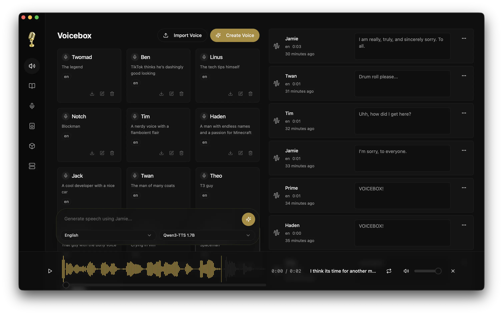

<p align="center">
  
</p>

<h1 align="center">Voicebox</h1>

<p align="center">
  <strong>The open-source AI voice studio.</strong><br/>
  Clone any voice. Generate speech. Dictate into any app. Talk to agents in voices you own.<br/>
  The full voice I/O stack, running locally on your machine.
</p>

<p align="center">
  <a href="https://github.com/jamiepine/voicebox/releases">
    
  </a>
  <a href="https://github.com/jamiepine/voicebox/releases/latest">
    
  </a>
  <a href="https://github.com/jamiepine/voicebox/stargazers">
    
  </a>
  <a href="https://github.com/jamiepine/voicebox/blob/main/LICENSE">
    
  </a>
</p>

<p align="center">
  <a href="https://voicebox.sh">voicebox.sh</a> •
  <a href="https://docs.voicebox.sh">Docs</a> •
  <a href="#download">Download</a> •
  <a href="#key-features">Features</a> •
  <a href="#mcp--api">API & MCP</a> •
  <a href="#development">Development</a>
</p>

> [!NOTE]
> **This fork (MaximusPrime77/voicebox) includes:**
> * 🇹🇷 **Full Turkish Language Support**: Translation of the entire application interface (registered as `tr` in `i18n`).
> * ⚡ **Windows AMD GPU Support**: Native DirectML & ROCm backend support enabled for AMD Radeon graphics cards on Windows.

<br/>

<p align="center">
  
</p>

---

## What is Voicebox?

Voicebox is a **local-first AI voice studio** — a free and open-source alternative to ElevenLabs and WisprFlow combined into a single native application. It runs the full voice input/output loop entirely on your own hardware, offering complete privacy.

* **Voice Output**: Generate speech using 7 different TTS engines, clone voices from short audio samples, and build multi-voice dialogues in a timeline editor.
* **Voice Input**: Dictate into any text field on your system using a global hotkey, powered by OpenAI Whisper and polished by a local refinement LLM.
* **Agent Integration**: Give local AI agents (Claude Code, Cursor, Cline) a voice over Model Context Protocol (MCP) using your cloned voice profiles.

---

## Download

| Platform | Download |
| --- | --- |
| **macOS (Apple Silicon)** | [Download DMG](https://voicebox.sh/download/mac-arm) |
| **macOS (Intel)** | [Download DMG](https://voicebox.sh/download/mac-intel) |
| **Windows** | [Download MSI](https://voicebox.sh/download/windows) |
| **Docker** | `docker compose up` |

> 📖 **Linux**: Pre-built binaries are not yet available. See the [Linux Installation Guide](https://voicebox.sh/linux-install) to build from source.

---

## Key Features

### 1. Multi-Engine Voice Cloning
Voicebox features seven distinct TTS engines, allowing you to choose the best tradeoff of quality, speed, and language coverage for each generation:

| Engine | Languages | Strengths |
| --- | --- | --- |
| **Qwen3-TTS** (0.6B / 1.7B) | 10 | High-quality multilingual cloning, natural language delivery controls |
| **Qwen CustomVoice** | 10 | 9 premium preset voices with expressiveness controls |
| **LuxTTS** | English | Lightweight (~1GB VRAM), 48kHz output, fast CPU inference |
| **Chatterbox Multilingual** | 23 | Widest language support (including Turkish, Arabic, Swedish, and more) |
| **Chatterbox Turbo** | English | Fast 350M model with paralinguistic emotion/sound tags (`[laugh]`, `[sigh]`) |
| **TADA** (1B / 3B) | 10 | HumeAI speech-language model for coherent long-form audio |
| **Kokoro** | 8 | 50 preset voices, tiny 82M model, extremely fast on CPU |

### 2. Global Dictation & Input Refinement
* **Push-to-Talk & Toggle Chords**: Hold a shortcut anywhere on your OS, speak, and release to inject text.
* **Auto-Paste & Clipboard Restore**: Automatically pastes the transcript into the active text field while preserving your existing clipboard contents.
* **Local LLM Refinement**: Runs a lightweight local LLM (Qwen3 0.6B/1.7B) to strip filler words (ums, uhs), restore punctuation, and remove self-corrections.

### 3. Voice Personalities
Attach a custom personality description to any voice profile. Powered by the local LLM runtime, this drives:
* **Compose**: Automatically generates in-character text snippets in the editor.
* **Speak in Character**: Rewrites your raw input text to match the character's persona and tone before sending it to the TTS engine.

### 4. Post-Processing Effects
Fine-tune outputs using 8 real-time DSP effects powered by Spotify's `pedalboard` library:
* Pitch Shift, Reverb, Delay, Chorus/Flanger, Compressor, Gain, High-Pass, and Low-Pass Filters.
* Save custom chains as reusable presets or assign them as default profiles.

---

## MCP & API

### Model Context Protocol (MCP)
Voicebox acts as a local MCP server, exposing tools to your coding agents:
* **`voicebox.speak`** — Speak text in a cloned voice with optional personality rewrite.
* **`voicebox.transcribe`** — Transcribe local audio or base64 streams using Whisper.
* **`voicebox.list_profiles` / `voicebox.list_captures`** — Query available voices and history.

**Claude Code Integration:**
```bash
claude mcp add voicebox --transport http --url http://127.0.0.1:17493/mcp --header "X-Voicebox-Client-Id: claude-code"
```

**Custom HTTP MCP config (Cursor, Windsurf, VS Code):**
```json
{
  "mcpServers": {
    "voicebox": {
      "url": "http://127.0.0.1:17493/mcp",
      "headers": { "X-Voicebox-Client-Id": "cursor" }
    }
  }
}
```

### REST API
You can also integrate Voicebox into custom scripts using standard HTTP endpoints:

```bash
# Generate speech via API
curl -X POST http://127.0.0.1:17493/generate \
  -H "Content-Type: application/json" \
  -d '{"text": "Hello from Voicebox", "profile_id": "Morgan", "language": "en"}'
```

---

## Tech Stack

* **Desktop App**: Tauri (Rust) & React (TypeScript, Tailwind CSS)
* **Backend Server**: FastAPI (Python 3.12)
* **Database**: SQLite (SQLAlchemy)
* **Effects**: Pedalboard (Spotify)
* **GPU Accel**: MLX (Apple Silicon) / PyTorch (CUDA / ROCm / DirectML / XPU)

---

## Development

See [CONTRIBUTING.md](CONTRIBUTING.md) for detailed setup guidelines.

### Quick Start (macOS / Linux)
1. Install [Prerequisites](https://v2.tauri.app/start/prerequisites/) (Bun, Rust, Python 3.12+, and Xcode on macOS).
2. Install [just](https://github.com/casey/just): `brew install just` or `cargo install just`.
3. Clone and start in development mode:
   ```bash
   git clone https://github.com/MaximusPrime77/voicebox.git
   cd voicebox
   just setup   # Creates Python venv, installs dependencies
   just dev     # Starts backend and Tauri desktop app
   ```

### Quick Start (Windows)
1. Install prerequisites (Bun, Rust, Python 3.12, Visual Studio C++ Build Tools).
2. Clone and set up the project:
   ```powershell
   git clone https://github.com/MaximusPrime77/voicebox.git
   cd voicebox
   bun install
   ```
3. Set up and run the Python backend and Tauri frontend in dev mode:
   * **Terminal 1** (Python Server):
     ```powershell
     py -3.12 -m venv .venv
     .venv\Scripts\Activate.ps1
     pip install -r backend/requirements.txt
     python -m backend.main --host 127.0.0.1 --port 17493
     ```
   * **Terminal 2** (Tauri Frontend):
     ```powershell
     bun run dev
     ```

### Building Standalone Installer
To package the application into a standalone installer (`.msi` or `.dmg`):
* **Windows**: Run our automated PowerShell build script:
  ```powershell
  .\build.ps1
  ```
* **macOS/Linux**: Use the justfile task:
  ```bash
  just build
  ```

---

## License

Voicebox is released under the [MIT License](LICENSE).

<p align="center">
  <a href="https://voicebox.sh">voicebox.sh</a>
</p>
