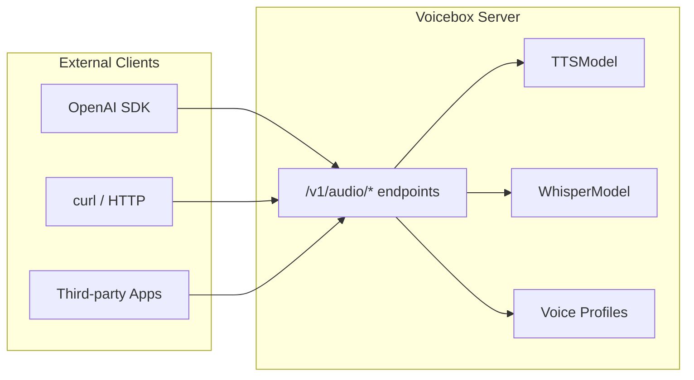

**Status:** Planned for v0.2.0

**Issue:** [#10 OpenAI API compatibility](https://github.com/jamiepine/voicebox/issues/10)

## Overview

This feature exposes OpenAI-compatible endpoints from Voicebox, allowing any tool, library, or application that speaks the OpenAI Audio API to use Voicebox as a drop-in local replacement.



## Use Cases

- **OpenAI SDK users**: `openai.audio.speech.create()` works with Voicebox
- **LLM frameworks**: LangChain, AutoGen, etc. can use Voicebox for TTS
- **Shell scripts**: `curl` commands copy-pasted from OpenAI docs work
- **Existing integrations**: Any tool expecting OpenAI's API works without code changes

## Endpoints to Implement

### 1. `POST /v1/audio/speech` (TTS)

OpenAI spec: https://platform.openai.com/docs/api-reference/audio/createSpeech

**Request:**

```json
{
	"model": "tts-1",
	"input": "Hello world!",
	"voice": "alloy",
	"response_format": "mp3",
	"speed": 1.0
}
```

**Response:** Audio file (mp3, wav, opus, aac, flac, pcm)

**Voice Mapping Strategy:**

- `voice` parameter maps to Voicebox profile names (case-insensitive)
- If no match, use a configurable default profile
- Support special syntax: `voice: "profile:uuid"` for explicit profile ID

### 2. `POST /v1/audio/transcriptions` (Whisper)

OpenAI spec: https://platform.openai.com/docs/api-reference/audio/createTranscription

**Request:** (multipart/form-data)

- `file`: Audio file
- `model`: "whisper-1"
- `language`: Optional language hint
- `response_format`: json, text, srt, verbose_json, vtt

**Response:**

```json
{
	"text": "Hello world!"
}
```

## Implementation Details

### New File: `backend/openai_compat.py`

Create a dedicated module with an APIRouter for OpenAI-compatible endpoints:

```python
from fastapi import APIRouter, UploadFile, File, Form, HTTPException
from fastapi.responses import StreamingResponse
from pydantic import BaseModel
from typing import Literal, Optional

router = APIRouter(prefix="/v1/audio", tags=["OpenAI Compatible"])

class SpeechRequest(BaseModel):
    model: str = "tts-1"
    input: str
    voice: str = "alloy"
    response_format: Literal["mp3", "wav", "opus", "aac", "flac", "pcm"] = "mp3"
    speed: float = 1.0

@router.post("/speech")
async def create_speech(request: SpeechRequest, db: Session = Depends(get_db)):
    # 1. Map voice name to profile
    # 2. Generate audio using existing TTSModel
    # 3. Convert to requested format
    # 4. Return audio stream
    ...

@router.post("/transcriptions")
async def create_transcription(
    file: UploadFile = File(...),
    model: str = Form("whisper-1"),
    language: Optional[str] = Form(None),
    response_format: str = Form("json"),
):
    # 1. Save uploaded file
    # 2. Transcribe using existing WhisperModel
    # 3. Return in requested format
    ...
```

### Voice Profile Resolution

Add helper in [backend/profiles.py](backend/profiles.py):

```python
async def resolve_voice_for_openai(voice: str, db: Session) -> Optional[VoiceProfile]:
    """
    Resolve OpenAI voice parameter to a Voicebox profile.

    Priority:
    1. Exact profile name match (case-insensitive)
    2. Profile ID match (if voice starts with "profile:")
    3. Default profile from config
    4. First available profile
    """
    ...
```

### Audio Format Conversion

Add conversion utilities in [backend/utils/audio.py](backend/utils/audio.py):

```python
def convert_audio_format(
    audio: np.ndarray,
    sample_rate: int,
    target_format: str,  # mp3, wav, opus, aac, flac, pcm
) -> bytes:
    """Convert audio to target format using ffmpeg or pydub."""
    ...
```

### Configuration

Add to [backend/config.py](backend/config.py):

```python
# OpenAI API Compatibility
OPENAI_COMPAT_ENABLED = True
OPENAI_COMPAT_DEFAULT_VOICE = None  # Profile ID or name for default voice
OPENAI_COMPAT_REQUIRE_AUTH = False  # Require API key validation
OPENAI_COMPAT_API_KEY = None        # If set, validate against this
```

### Integration with main.py

In [backend/main.py](backend/main.py), include the router:

```python
from . import openai_compat

# Add OpenAI-compatible routes
if config.OPENAI_COMPAT_ENABLED:
    app.include_router(openai_compat.router)
```

## Streaming Support (Future Enhancement)

Initial implementation returns complete audio. Streaming can be added later:

```python
@router.post("/speech")
async def create_speech(request: SpeechRequest):
    if request.stream:
        return StreamingResponse(
            generate_audio_chunks(request),
            media_type=f"audio/{request.response_format}"
        )
    ...
```

## Testing

Example usage after implementation:

```bash
# TTS with curl
curl http://localhost:8000/v1/audio/speech \
  -H "Content-Type: application/json" \
  -d '{"model": "tts-1", "input": "Hello!", "voice": "MyProfile"}' \
  --output speech.mp3

# With OpenAI Python SDK
from openai import OpenAI
client = OpenAI(base_url="http://localhost:8000/v1", api_key="unused")
response = client.audio.speech.create(
    model="tts-1",
    voice="MyProfile",
    input="Hello world!"
)
response.stream_to_file("output.mp3")

# Transcription
curl http://localhost:8000/v1/audio/transcriptions \
  -F file=@audio.mp3 \
  -F model="whisper-1"
```

## Security Considerations

- Optional API key validation (for shared deployments)
- Rate limiting on endpoints
- Input length limits (same as existing `/generate` endpoint)

## Dependencies

- `pydub` or `ffmpeg-python` for audio format conversion (mp3, opus, etc.)
- No changes to existing TTS/Whisper model code
